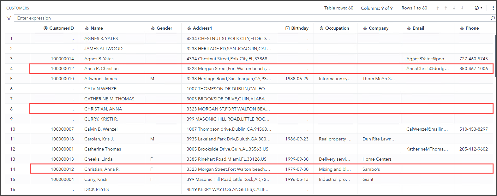
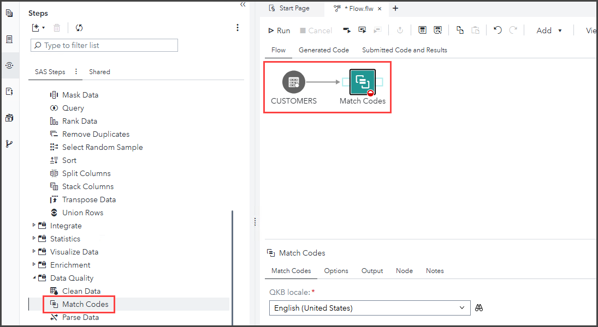
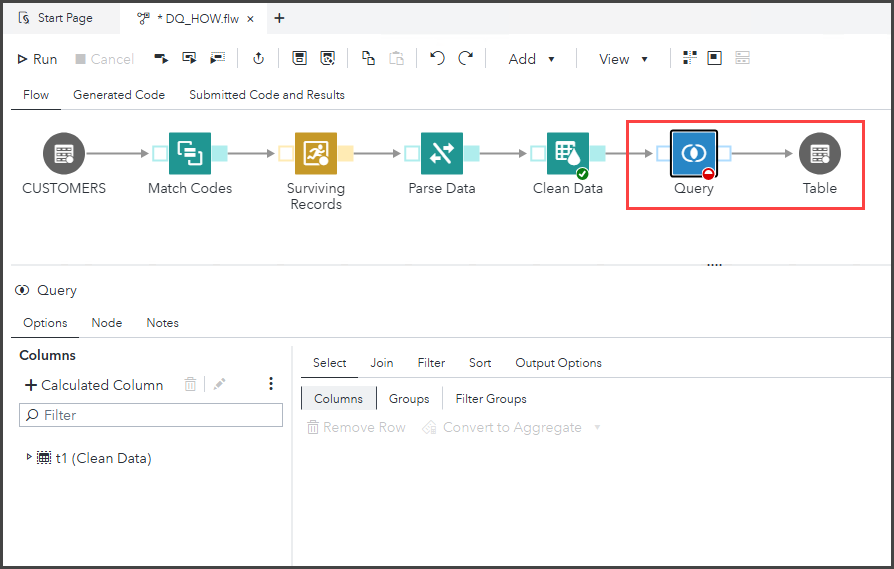

# Power Washing Your Data: Using SAS Data Quality Steps in SAS Studio Flows

* [Exercise Description](#exercise-description)
* [Log in to SAS Viya](#log-in-to-sas-viya)
* [Create a SAS Studio Flow](#create-a-sas-studio-flow)
   * [Generate Match Codes](#generate-match-codes)
   * [Remove Duplicates with Survivorship Snippet](#remove-duplicates-with-survivorship-snippet)
   * [Parse Address Data](#parse-address-data)
   * [Standardize Data](#standardize-data)
   * [Create Output Table](#create-output-table)
* [Exercise Completed](#exercise-completed)

## Exercise Description

Update your data cleaning process with point-and-click data quality steps in SAS Studio Flows! In this hands-on workshop, you'll learn how to build a flow that deduplicates, parses, and standardizes your data with SAS Data Quality steps and code snippets.

## Log in to SAS Viya

Open a new window in the *Google Chrome* browser and select the **SAS Viya** bookmark.

* ID: **student**
* Password: **Metadata0**

Select **No** when prompted about accepting *Admin* privileges.

## Create a SAS Studio Flow

1. Select  **&#10132; Develop Code and Flows** to open *SAS Studio*.
1. Select **New &#10132; Flow**.
1. Select  to view the **Steps** pane.

   

1. Expand the *Data (Input and Output)* section of the *Steps* pane. Double-click the **Table** step to add it to the flow canvas.
1. Select the **Table**  node on the flow canvas. In the **Table Properties** section, select the following:

   * Library: **DQWS**
   * Table name: **CUSTOMERS**

   

1. Click **Preview Data** to view a subset of rows from the table.
     > &#9998; If needed, click  to hide the Steps pane, or click  to maximize the preview.

   

   CUSTOMERS has **60** rows and **9** columns. Note that:
     * Each customer appears three times.
     * All rows have *Name* and *Address* values.
     * Most rows have a non-missing *CustomerID* value.
     * Customer *Name* values differ in each appearance (casing, name order, inclusion of middle initial or use of nickname).
     * Rows with non-missing *Gender* values also have non-missing *CustomerID*, *Birthday*, *Occupation*, and *Company* values.
     * Rows with non-missing *Email* values also have non-missing *CustomerID* and *Phone* values.

   We would like to deduplicate this data by combining unique values into one row per customer. First, we'll generate match codes to determine which rows represent the same customers.

### Generate Match Codes

1. Restore your screen view if needed.
1. Expand the *Data Quality* section of the *Steps* pane. Double-click the **Match Codes** step to add it to the flow canvas.
1. Drag the *Match Codes* step to the right of *CUSTOMERS*. Use your mouse to draw an arrow connecting *Customers* to the *Match Codes* step.
1. (Optional) Click  on the flow toolbar to arrange the nodes.

   

1. In the *Match Codes* tab for the *Match Codes* step, ensure that the default QKB locale (**English (United States)**) is selected.
1. Configure the *Match Codes* step as follows:
     * Match column: **Address1**
     * New match column name: **[Leave blank]**
     * Definition: **Address**
     * Sensitivity: **85**

   

1. Select  to save the flow.
1. Navigate to **SAS Content &#10132; Public**. Save the file as **DQ_HOW.flw**.
1. Select  on the flow toolbar to run the flow.
1. After the flow has run successfully, click the shaded **output port** on *Match Codes*.
1. Click **Preview Data** to review the output.

   

1. Click  in the *Preview Data* window and select **Column Selection**.
1. In the *Column Selection* window, deselect all columns, then individually select **Name**, **Address1**, and **Address1_MC85**, then click **OK**.

   

1. Review the output on the *Preview Data* tab.

   

   Notice that rows with equivalent *Address1* values generated the same match codes regardless of *Address1* format. We can use these match codes to combine customer data into one surviving record.

### Remove Duplicates with Survivorship Snippet

1. Add the **SAS Program** step from the *Develop* section of the *Steps* pane to the flow canvas and connect it to the *Match Nodes* step.
1. **Arrange** the nodes and **save** the flow.

   

1. Select  to open the **Snippets** pane.
1. Expand **Standard &#10132; Data Quality** and double-click **Survivorship** to open the *Survivorship* snippet in a new tab.

   

   Per the snippet documentation: *The snippet shows examples of how to use the %dqsurvr autocall macro to identify a surviving record from a group of records in a cluster. It also shows different methods to compose and indicate the surviving record.*

1. Copy the first example that calls the %dqsurvr macro **(lines 52 - 59)** and paste it into the SAS Program node's *Code* tab.

   <p><details markdown="block">

   <summary>Click to view or copy the required section of code.</summary>

   ```bash
   %dqsurvr (inTable=contacts,
              outTable=work.contacts_out,
              clusterColumn=cluster_id,
              rowRule1=(max,ID),
              firstColumnRule1=(highocc,State),
              firstColumnRuleAppliedCols=(Zipcode),
              secondColumnRule1=(not_missing, Address),
              keepDuplicates=0);
    ```

   </details></p>

   

1. Edit the macro parameters as follows:

   * inTable=**&_input1**
   * outTable=**&_output1**
   * clusterColumn=**Address1_MC85**
   * rowRule1=**(longest, Name)**
     > &#9998; The surviving record will be chosen by the longest **Name** value, because this should be the fullest version of the customer's name.
   * firstColumnRule1=**(not_missing, Gender)**
     > &#9998; The surviving record should store the first non-missing *Gender* value from the cluster records.
   * firstColumnRuleAppliedCols=**(Birthday, Occupation, Company)**
     > &#9998; The surviving record should store the *Birthday*, *Occupation*, and *Company* values from the row satisfying *firstColumnRule1*.
   * secondColumnRule1=**(not_missing, Email)**
     > &#9998; The surviving record should store the first non-missing *Email* value from the cluster records.
   * **Add secondColumnRuleAppliedCols=(CustomerID, Phone),** (including comma after option)
     > &#9998; The surviving record should store the *CustomerID* and *Phone* values from the row satisfying *secondColumnRule1*.
   * **Add a comma after** keepDuplicates=**0**
   * **Add generateDistinctSurvivor=1** after keepDuplicates=**0**

   <p><details markdown="block">

   <summary>Click to view or copy the edited macro call.</summary>

   ```bash
   %dqsurvr (inTable=&_input1,
          outTable=&_output1,
          clusterColumn=Address1_MC85,
          rowRule1=(longest,Name),
          firstColumnRule1=(not_missing,Gender),
          firstColumnRuleAppliedCols=(Birthday,Occupation,Company),
          secondColumnRule1=(not_missing,Email),
          secondColumnRuleAppliedCols=(CustomerID,Phone),
          keepDuplicates=0,
          generateDistinctSurvivor=1);
    ```

   </details></p>

   

1. On the **Node** tab, re-name the node to **Surviving Records**.

   

1. **Save** the changes to the flow.
1. **Right-click** *Surviving Records* and select **Run node**. Select the **output port** of *Surviving Records* and **preview** the results.

   

   The output table has **20** rows and **5** columns. Duplicate records were accurately condensed to store all customer data in one record. Next, we'll parse *Address1* and store individual tokens like Street, City, and State in separate columns.

### Parse Address Data

1. Select  to return to the **Steps** pane.
1. Add the **Parse Data** step from the *Data Quality* section of the *Steps* pane to the flow canvas and connect it to the *SAS Program (Surviving Records)* step.
1. **Arrange** the nodes and **save** the flow.

   

1. In the *QKB Locale* tab for the *Parse Data* step, ensure that the default QKB locale (**English (United States)**) is selected.

   

1. On the *Parsing* tab, check the box to **Enable parsing**.

   

1. Configure the *Parse Data* step as follows:
     * Select column: **Address1**
     * Definition: **Address (Full)**
     * Select tokens: **City**, **Country**, **Postal Code**, **State/Province**, **Street**

   

1. **Save** the changes to the flow.
1. **Right-click** *Parse Data* and select **Run node**. Select the **output port** of *Parse Data* and **preview** the results.
     > &#9998; Use the *Column Selection* option or scroll all the way to the right in the *Preview Data* window to see new columns.

   

   The output table has **5** new columns storing the **City**, **Country**, **Postal Code**, **State/Province**, and **Street** from each *Address1* value. Note that:
     * **Address1_CITY** varies in casing. Some city names are written in uppercase, while others are in proper case.
     * **Address1_STATE_PROVINCE** varies in format. Some state names are written in full, while others are written in abbreviations.
     * **Address1_STREET** varies in casing and format. Specifically, some street addresses use full road names, while others use abbreviations.
     * **Address1_COUNTRY** uses a consistent country abbreviation standard, but we'd like to see the full country name instead.
   We'll correct these issues and others with the Clean Data step.

### Standardize Data

1. Add the **Clean Data** step from the *Data Quality* section of the *Steps* pane to the flow canvas and connect it to the *Parse Data* step.
1. **Arrange** the nodes and **save** the flow.

   

1. In the *QKB Locale* tab for the *Clean Data* step, ensure that the default QKB locale (**English (United States)**) is selected.
1. On the *Standardization* tab, check the box to **Enable standardization**.
1. Configure the *Clean Data* step as follows:
     * Select column: **Name**
     * Definition: **Name**
     * Column options: **Create new column**
     * New column: **[Leave blank]**

   

1. Under the *Additional Standardize* heading, repeat this process to standardize columns as specified below. **For all *Additional Standardize* columns, select *Create new column* and leave the new column name *blank*.**

     | Select Column | Definition |
     |  :---  |  :---  |
     | Address1_CITY | City |
     | Address1_STATE_PROVINCE | State/Province (Full Name) |
     | Address1_STREET | Address |
     | Address1_COUNTRY | Country |

1. **Save** the changes to the flow.
1. **Right-click** *Clean Data* and select **Run node**. Select the **output port** of *Clean Data* and **preview** the results.
     > &#9998; If the *Clean Data* step fails with *ERROR: Key not found* and *ERROR: Error in the FILENAME statement*, simply run the step again. This is a known bug which is resolved by executing again.
      

1. (Optional) use the *Column selection* option to limit the column view in the *Preview Data* window.

   

   Standardized names are proper cased and written in **First MI Last** format.

   

   Standardized city, state, and country names are proper cased and written in full instead of abbreviated.

   

   Standardized street names are proper cased and road type names (Street, Drive, Avenue, etc) are shortened.

   We'll finish by creating an output table to store the final results.

### Create Output Table

1. Add the **Query** step (from the *Transform Data* section of the *Steps* pane) to the flow canvas and connect it to the *Clean Data* step.
1. Right-click the *Query* step output port and select **Add a table**.
1. **Arrange** the nodes and **save** the flow.

   

1. Select the **Table**  node on the flow canvas. In the **Table Properties** section, type the following table attributes:

   * Library: **DQWS**
   * Table name: **CUSTOMERS_CLEAN**
   * Select **Create a physical table** (default selection)

   

1. Select the **Query** node on the flow canvas. In the *Options* tab, expand **t1 (Clean Data)** to view all source columns.

   

1. Select the following columns and update their attributes on the *Select* tab:

     | Source | Name | Label |
     |  :---  |  :---  |  :---  |
     | CustomerID | CustomerID | **Customer ID** |
     | Name_STND | **Name** | |
     | Address1_STREET_STND | **Street** | |
     | Address1_CITY_STND | **City** | |
     | Address1_STATE_PROVINCE_STND | **State** | |
     | Address1_POSTALCODE | **PostalCode** | **Postal Code**|
     | Address1_COUNTRY_STND | **Country** | |
     | Gender | Gender | |
     | Birthday | Birthday | |
     | Occupation | Occupation | |
     | Company | Company | |
     | Email | Email | |
     | Phone | Phone | |

     > &#9998; Updates to column attributes are **bolded**.

   

1. Click the *Sort* tab.
1. Double-click *CustomerID* to add it to the *Sort* tab. Keep the default sort order selection (**Ascending**).

1. **Save** the changes to the flow.
1. **Right-click** *Query* and select **Run node**. Select the output table **CUSTOMERS_CLEAN** and **preview** the results.
     > &#9998; If needed, click  to hide the Steps pane, or click  to maximize the preview.

   

1. **Close** the *DQ_HOW.flw* file tab after reviewing the results.

## Exercise Completed

**You have completed the exercise on building a flow with SAS Data Quality!**

**THANK YOU FOR ATTENDING THIS WORKSHOP!**