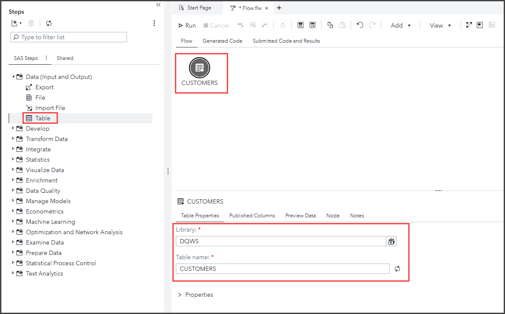
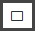

# Power Washing Your Data: Using SAS Data Quality Steps in SAS Studio Flows

* [Exercise Description](#exercise-description)
* [Log in to SAS Viya](#log-in-to-sas-viya)
* [Create a SAS Studio Flow](#create-a-sas-studio-flow)
    * [Remove Duplicates with Survivorship Snippet](#remove-duplicates-with-survivorship-snippet)
* [TBD](#tbd)

## Exercise Description

Update your data cleaning process with point-and-click data quality steps in SAS Studio Flows! In this hands-on workshop, you'll learn how to build a flow that deduplicates, standardizes, parses, and combines your data with SAS Data Quality steps and code snippets.

## Log in to SAS Viya

Open a new window in the *Google Chrome* browser and select the **SAS Viya** bookmark.

* ID: **student**
* Password: **Metadata0**

Select **No** when prompted about accepting *Admin* privileges.

## Create a SAS Studio Flow

1. Select  **&#10132; Develop Code and Flows** to open *SAS Studio*.
1. Select **New &#10132; Flow**.
1. Select  to view the **Steps** pane.

   

1. Expand the *Data (Input and Output)* section of the *Steps* pane. Double-click the **Table** step to add it to the flow canvas.
1. Select the **Table**  node on the flow canvas. In the **Table Properties** section, select the following:

   * Library: **DQWS**
   * Table name: **CUSTOMERS**

   

1. Click **Preview Data** to view a subset of rows from the table. If needed, click  to maximize the preview.

   

   Note that each customer appears three times with different name formats and varying additional column information. We would like to deduplicate this data by combining unique values into one row per customer.

### Remove Duplicates with Survivorship Snippet

1. Expand the *Develop* section of the *Steps* pane. Double-click the **SAS Program** step to add it to the flow canvas.
1. Drag the *SAS Program* step to the right of *CUSTOMERS*. Use your mouse to draw an arrow connecting *Customers* to the *SAS Program* step.

   

1. Select  to open the **Snippets** pane.
1. Expand **Standard &#10132; Data Quality** and double-click **Survivorship** to open the *Survivorship* snippet in a new tab.

   

   Per the snippet documentation: *The snippet shows examples of how to use the %dqsurvr autocall macro to identify a surviving record from a group of records in a cluster. It also shows different methods to compose and indicate the surviving record.*

1. Copy the first example that calls the %dqsurvr macro **(lines 52 - 59)** and paste it into the SAS Program node's *Code* tab.

   <p><details markdown="block">

   <summary>Click to view or copy the required section of code.</summary>

   ```bash
   %dqsurvr (inTable=contacts,
              outTable=work.contacts_out,
              clusterColumn=cluster_id,
              rowRule1=(max,ID),
              firstColumnRule1=(highocc,State),
              firstColumnRuleAppliedCols=(Zipcode),
              secondColumnRule1=(not_missing, Address),
              keepDuplicates=0);
    ```

   </details></p>

## TBD